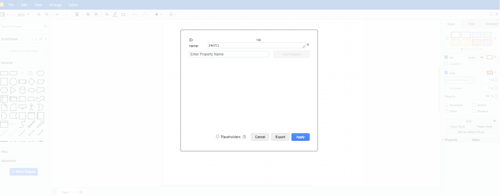

# reactive-svg

## 概要

draw.ioで作成したsvgを動的に動かすためのライブラリ

## 使い方

1. パッケージのインストール

```shell
npm install @nagasakah/reactive-svg
```

2. draw.ioで図を作成してSVGとして出力する(例ではtest.drawio.svgとして出力)  
※svgdataプラグインが有効になっていること  
四角形を作成=>図形を選択=>Edit Data=>IDにnameを入力=>任意のPropertyを入力してApplyを押下  

1. public/md/配下に表示させいたいmarkdownファイルを配置(例: helloworld.mdを下記の内容で作成)

```markdown
# Hello World
hello world
```

1. Reactの場合

```tsx
import React, { useEffect, useRef } from "react";
import { ReactComponent as Test } from "./test.drawio.svg";
import { reactiveSVGSettings, loadSettings } from "@nagasakah/reactive-svg";

const settings: reactiveSVGSettings = {
  baseURL: `${process.env.PUBLIC_URL}md/`,
  events: [
    {
      name: "rect1",
      markdownFile: "helloworld.md",
    },
  ],
};
function App() {
  const ref = useRef<SVGSVGElement>(null);
  useEffect(() => {
    if (ref.current) {
      loadSettings(settings, ref.current);
    }
  }, [ref]);
  return (
    <div className="App">
      <Test ref={ref} />
    </div>
  );
}

export default App;
```

詳細は[サンプルプロジェクト](https://github.com/NagasakaH/reactive-svg-sample)を参照してください
